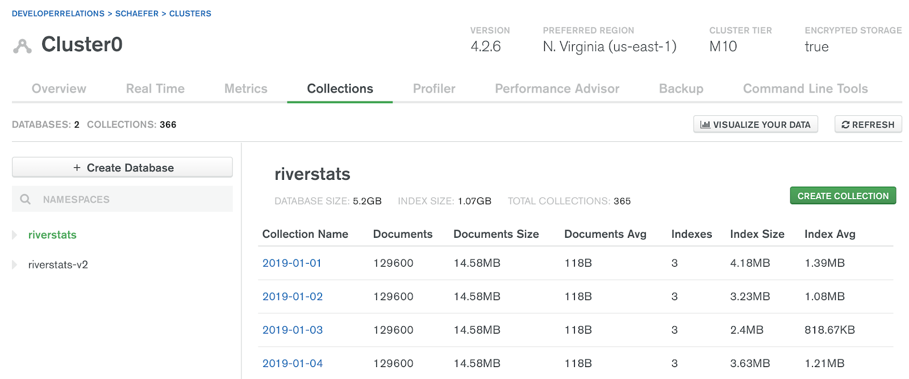
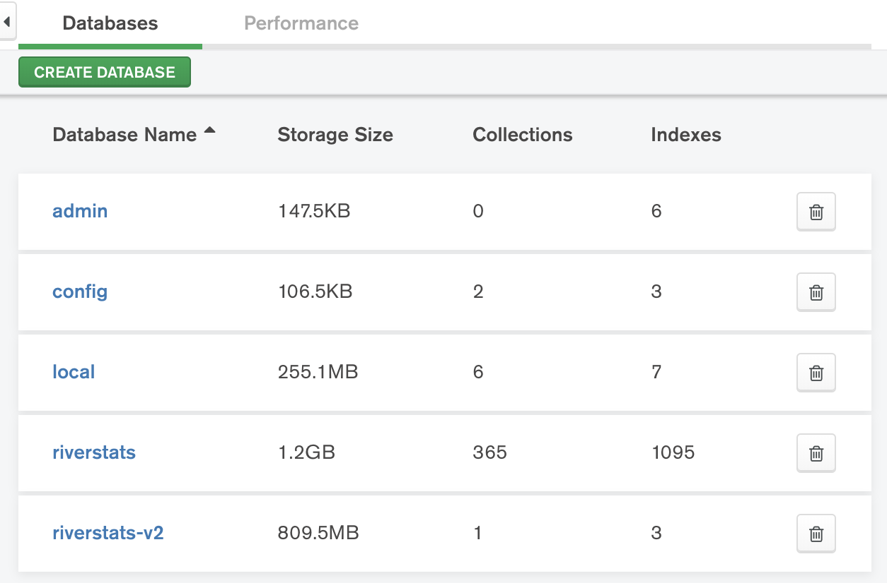
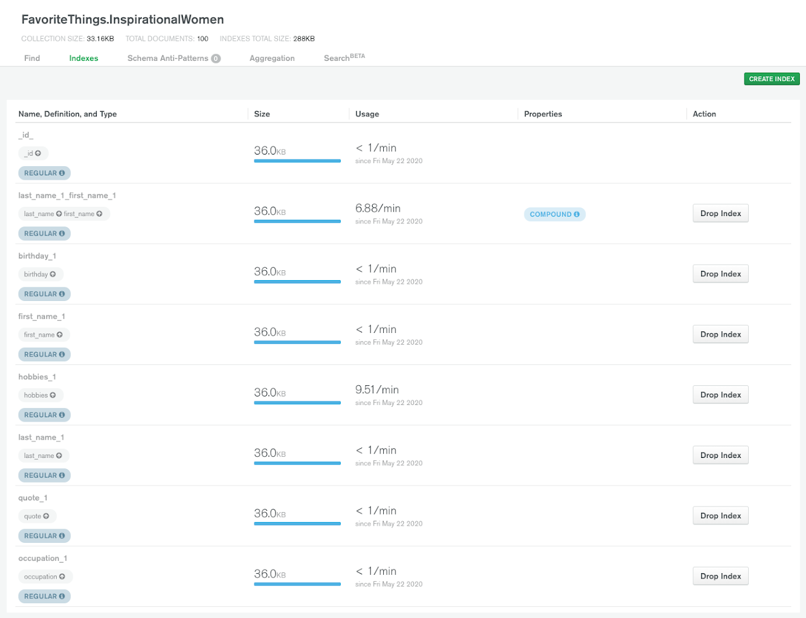
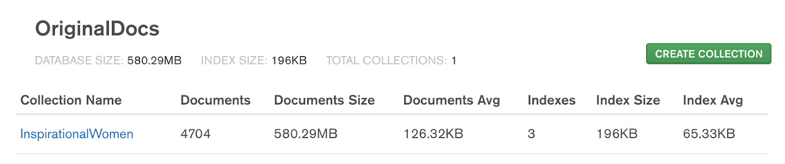
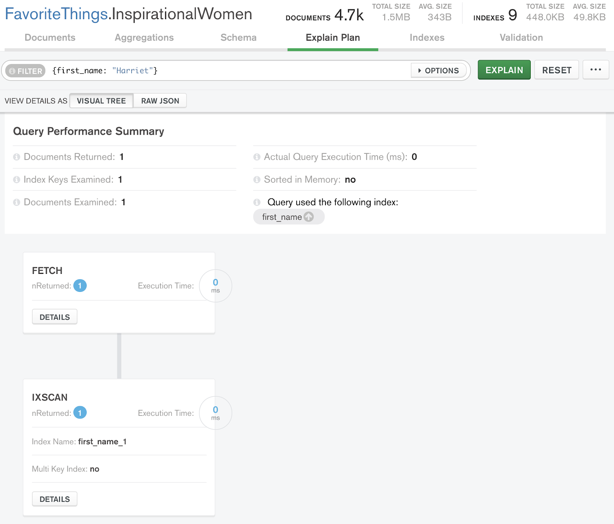
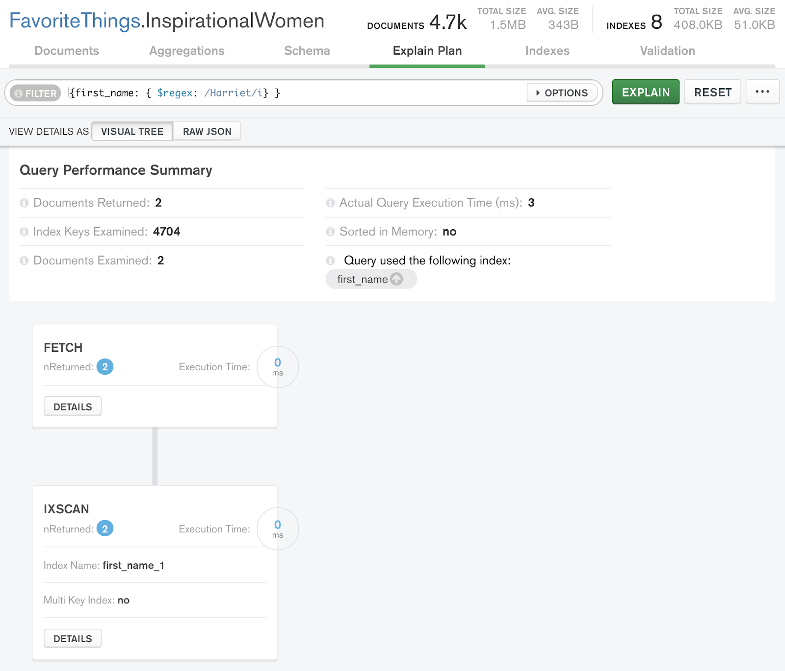
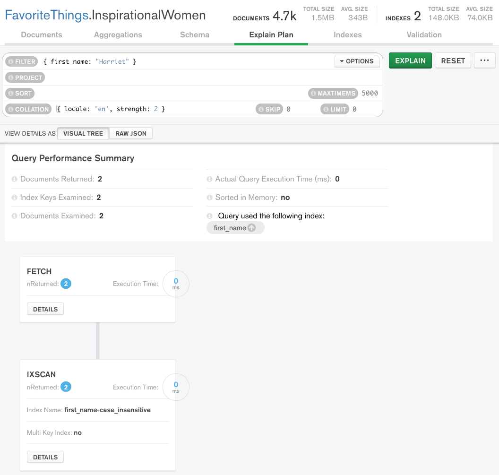

## References
1. [Massive Arrays](https://www.mongodb.com/developer/article/schema-design-anti-pattern-massive-arrays/)

## Rule of thumbs
1. What data will you need to store?
2. What data is likely to be accessed together?
	- Data which is accessed together should be stored together, i.e. embedding in `subdocuments` or `arrays`
3. What queries will be run most frequently?
4. What data is likely to grow at a rapid, unbounded pace?

## [Anti Patterns Summary](https://www.mongodb.com/developer/article/schema-design-anti-pattern-summary/)
1. **Massive arrays**: storing massive, unbounded arrays in your documents.
2. **Massive number of collections**: storing a massive number of collections (especially if they are unused or unnecessary) in your database.
3. **Unnecessary indexes**: storing an index that is unnecessary because it is (1) rarely used if at all or (2) redundant because another compound index covers it.
4. **Bloated documents**: storing large amounts of data together in a document when that data is not frequently accessed together.
5. **Separating data that is accessed together**: separating data between different documents and collections that is frequently accessed together.
6. **Case-insensitive queries without case-insensitive indexes**: frequently executing a case-insensitive query without having a case-insensitive index to cover it.

## Anti Patterns Detailed
### [Massive Arrays](https://www.mongodb.com/developer/article/schema-design-anti-pattern-massive-arrays/)
- e.g. storing all employee data in a buildings collection
#### Problems
- Embedded arrays are unbounded
- Potentially exceeding 16mb limit
- Reading and building indexes on arrays gradually becomes less performant as array size increases

#### Workarounds
1. Flip 
   - store buildings data into employee collection instead
	- makes sense if we are frequently displaying info about building and employee together
	- **But**, may have alot of **data duplication**
    	- storage cheap, so cost may not be an issue
    	- not good if information is updated frequently as need to update in both collections

2. Use references
	- parent referencing from child
	- can also be child referencing (ObjectIDs), but to be mindful of size of Arrays
	- **But**, need to use `$lookup`, which may be expensive to use
    	- check if lookup is used often

3. Extended references
	- mixture of 2 approaches above
	- but just storing a few information from the buildngs collection in the employees collection.

#### Takeaways
- Storing related information that you'll be frequently querying together is generally good.
- Storing information in massive arrays that will continue to grow over time is generally bad.

### [Massive collections](https://www.mongodb.com/developer/article/schema-design-anti-pattern-massive-number-collections/)
#### Id field
- Collections automatically have index on `_id` field
  - collections typically have few more indexes to support efficient queries
  - **But**, thousands of empty or unused indexes can drain resources
- WiredTiger storage (MongoDB's default storage engine) stores a file for **collection** and a file for **indexes**
  - All files will be opened upon startup, performance decrease when excessive collections and indexes exist
  - Generally, limit to 10,000 collections

#### Other problems
- May be difficult to find data since it is spread across many collections

#### Workarounds
1. Removing unnecessary collections
	- move relevant fields to other collection (e.g. by using `$merge`,  and delete unnecessary collection
3. Remodelling data to have consistent set of collections
	- may result in massive reductions in index sizes
	- [Modelling time series data in MongoDB](https://www.mongodb.com/blog/post/building-with-patterns-the-bucket-pattern)

#### Resources to check for Database information
1. MongoDB Atlas

2. MongoDB Compass

3. Mongo Shell

### [Unnecessary Indexes](https://www.mongodb.com/developer/article/schema-design-anti-pattern-unnecessary-indexes/)
#### Overview
- Scanning data in MongoDB
  - Indexes allow efficient querying of data
  - If query does not support indexes, MongoDB performs a collection scan
    - i.e. scanning **every** document in collection
    - scans can be very slow
    - If frequently execute query, make sure there is index to support it

#### Why Indexes are anti-patterns
1. Indexes **take up space** - at least 8kB, and grows with number of documents associated with it
2. Impact **storage engine's performance** - WiredTiger stores file for each collection & index, and all files are opened during startup
3. Impact **write performance** - document created, updated or deleted must have index associated updated as well. Index updates impact performance

#### Rule of thumb
- limit collection to 50 indexes

#### Workarounds
1. Removing **unnecessary** or **infrequently** used Indexes
2. Determine if index is redundant because another **compound index** covers it

#### Resources to check for Index usage
1. MongoDB Atlas

2. MongoDB Compass

### [Bloated Documents](https://www.mongodb.com/developer/article/schema-design-anti-pattern-bloated-documents/)
- 16MB size limit for documents

#### RAM
- WiredTiger keeps indexes and documents frequently accessed in memory.
  - i.e. **Working Set**
  - when working set fits in RAM allotment, MongoDB can query from memory instead of from disk
  - Queries from memory are faster -> Goal is to keep most popular documents in RAM

- Working set's RAM allotment is larger of:
  - 50% of (RAM - 1GB)
  - 256MB

#### Rule of thumb
- **Reminder**: data that is accessed together should be stored together
- **Does not mean**: data that is related to each other should be stored together.
- Sometimes, data which is related to each other isn't accessed together
  - in this case, may be better to separate information into **smaller documents** in **separate collections**, and use references to connect them togehther
  - Refer [Subset Pattern](https://www.mongodb.com/blog/post/building-with-patterns-the-subset-pattern)

#### Workarounds
1. Increasing memory/RAM
2. Restructure according to [Subset Pattern](https://www.mongodb.com/blog/post/building-with-patterns-the-subset-pattern)
	- deciding which information is important to be included in working set
	- e.g. splitting collection into `Summary` and `Detailed`
	- adding references between 2 splitted collections

#### Consideration over subset pattern
1. Data duplication, frowned upon due to 
	- **space constraints**
    	- not an issue if memory is cheap
	-  challenge to **keep data updated** in both collections
      	- not an issue if data duplicated is not updated often
      	- don't need to duplicate all data, maybe some only depending on application use case 

#### Dashboards
1. Atlas Data Explorer

### [Separateing data that is accessed together](https://www.mongodb.com/developer/article/schema-design-anti-pattern-separating-data/)
#### Normalizing data
- i.e. splitting data into tables
  - natural for relational databases
- MongoDB -> best not to split data

#### `JOIN` and `$lookup`
- `$lookup` is alternative of joining for MongoDB
  - good for infrequent, rarely used operations
  - analytical queries
  - queries that run overnight
- `$lookup` operations are slow and resource-intensive compared to operations that don't need to combine data from more than one collection.

#### Rule of thumb
- Data that is accessed together should be stored together.
  - Leverage on `embedding` rather than separating in different collections
- Need to balance with **massive unbounded arrays** or **bloated documents**

#### Workarounds
- [Subset Pattern](https://www.mongodb.com/blog/post/building-with-patterns-the-subset-pattern)
  - Duplicate some **documents** for all **info** -> split to detailed and summary
- [Extended Reference Pattern](https://www.mongodb.com/blog/post/building-with-patterns-the-extended-reference-pattern)
  - Duplicate some **info** for all **documents**, but all documents
- Usually use a combination of above

### [Case-Insensitive Queries Without Case-Insensitive Indexes](https://www.mongodb.com/developer/article/schema-design-anti-pattern-case-insensitive-query-index/)

#### 3 primary methods to run case-insensitive queries
1. use `$regex` with `i` option
	- does not utilise case insensitive **indexes**
	- queries **slow** depending how much data in collection
2. creating **case insensitive index**
	- (technical) with a collation index of `1` or `2`
	- and running a query with same collection as index
	- execute **very quickly**
	- usual issues surrounding using indexes
3. setting default collation strength (of `1` or `2`) when **creating collection**
	- all queries in collection will use default collation
	- [more details](https://www.mongodb.com/developer/article/schema-design-anti-pattern-case-insensitive-query-index/)

#### Helpful debugging
1. using `.explain("executionStats") `
2. using Compass
	- default with no regex
		
	- `$regex` - a little slower
		
	- using case insensitive indexes
		
